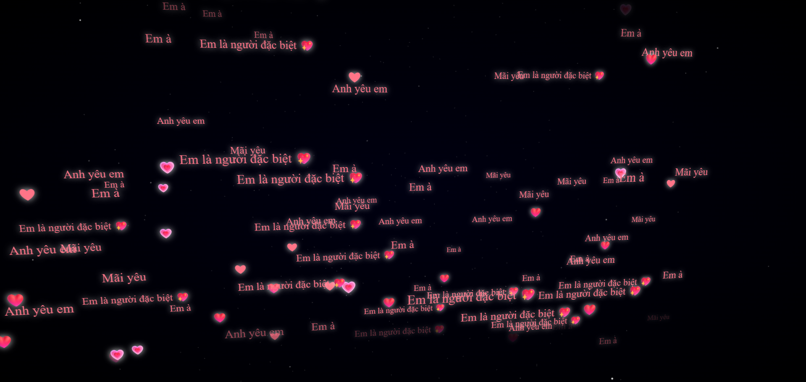

# 💖 BBI I Love You



# 💌 Lời Yêu Gửi Đến Em

> "Em à, em là người đặc biệt... Anh yêu em – Mãi yêu!"

🌌 Đây là một trang web nhỏ được tạo ra để gửi gắm những lời yêu thương chân thành và dịu dàng nhất. Trên nền trời đêm lấp lánh, những trái tim và câu nói như _"Anh yêu em"_, _"Em là người đặc biệt"_, _"Mãi yêu"_... sẽ bay lơ lửng, như chính tình cảm mà anh luôn muốn dành trọn cho em.

## 🎯 Mục đích

Trang web này không chỉ là một dự án lập trình — mà là một món quà. Một không gian để thể hiện tình cảm, sự quan tâm và những lời chưa nói. Dành riêng cho người anh yêu.

## 🛠️ Công nghệ sử dụng

- HTML, CSS, JavaScript
- Hiệu ứng Canvas Animation để tạo các câu từ và trái tim bay lơ lửng
- Thiết kế đơn giản, dễ triển khai trên GitHub Pages hoặc máy cá nhân

## 🚀 Cách chạy dự án

```bash
git clone https://github.com/ten-cua-ban/du-an-tinh-yeu.git
cd du-an-tinh-yeu
open index.html
